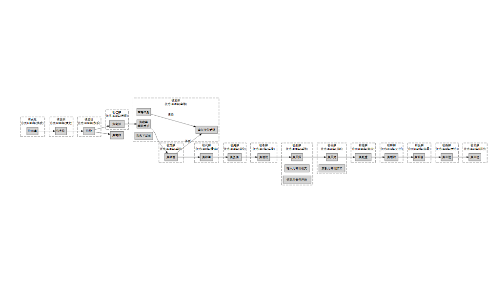

<!-- README.md is generated from README.Rmd. Please edit that file -->

# add2grViz

<!-- badges: start -->

<!-- badges: end -->

<!-- The goal of add2grViz is to ... -->

I read the history about Ming Dynasty, and implement `DiagrammeR` to
plot a flow chart for the kings. In the workflow, I create several
functions to fast the task.

## Installation

You can install the released version of add2grViz from
[CRAN](https://CRAN.R-project.org) with:

``` r
install.packages("add2grViz")
```

## Example

This is a basic example which shows you how to solve a common problem:

``` r
library(add2grViz)
library(magrittr)
#> Warning: package 'magrittr' was built under R version 3.6.1
library(tidyverse)
#> Registered S3 methods overwritten by 'ggplot2':
#>   method         from 
#>   [.quosures     rlang
#>   c.quosures     rlang
#>   print.quosures rlang
#> ── Attaching packages ───────────────────────────────────────────────────── tidyverse 1.2.1 ──
#> <U+2713> ggplot2 3.1.1     <U+2713> purrr   0.3.3
#> <U+2713> tibble  2.1.3     <U+2713> dplyr   0.8.3
#> <U+2713> tidyr   0.8.3     <U+2713> stringr 1.4.0
#> <U+2713> readr   1.3.1     <U+2713> forcats 0.4.0
#> Warning: package 'purrr' was built under R version 3.6.1
#> Warning: package 'dplyr' was built under R version 3.6.1
#> ── Conflicts ──────────────────────────────────────────────────────── tidyverse_conflicts() ──
#> x tidyr::extract()   masks magrittr::extract()
#> x dplyr::filter()    masks stats::filter()
#> x dplyr::lag()       masks stats::lag()
#> x purrr::set_names() masks magrittr::set_names()
## basic example code
```

``` r
link_plus <-
    "宣德皇后 -> 于谦 [label = '提拔']
朱祁镇 -> 于谦 [label = '杀死']
朱棣 -> 朱高煦
"
```

``` r
output <-
    add2grViz::ming_kings %>%
    mutate(block = map2_chr(text, name, add_content_subgraph)) %>%
    mutate(tag = LETTERS[1:nrow(.)],
           add_func = map2_chr(tag, block, frame_subgraph)) %>%
    summarise(text = str_flatten(add_func, "\n\n"),
              links = str_flatten(name, " -> ")) %>%
    mutate(add_heading = pmap_chr(list(text, links, link_plus), add_heading)) %>%
    dplyr::pull()
```

``` r
output_text <- 
output %>%
    str_replace("朱瞻基",
                fixed("朱瞻基 [label = '朱瞻基\n蟋蟀天子']
宣德皇后
于谦 [label='当朝少保于谦']
郑和下西洋")) %>%
    str_replace("朱厚照", "朱厚照
帖木儿帝国覆灭
侠客风云传开始") %>%
    str_replace("朱厚熜", "朱厚熜
莫卧儿帝国建立")


output_text %>% 
    cat
#> digraph course {
#> rankdir = LR
#> node [shape = box, style=filled]
#> layout = dot
#> compound =true
#> #color = crimson
#> 
#> subgraph clusterA{
#> label = '明太祖\n公元1368年(洪武)'
#> style = dashed
#> rank = same
#> 
#> 朱元璋
#> 
#> }
#> 
#> subgraph clusterB{
#> label = '明惠宗\n公元1398年(建文)'
#> style = dashed
#> rank = same
#> 
#> 朱允炆
#> 
#> }
#> 
#> subgraph clusterC{
#> label = '明成祖\n公元1402年(永乐)'
#> style = dashed
#> rank = same
#> 
#> 朱棣
#> 
#> }
#> 
#> subgraph clusterD{
#> label = '明仁宗\n公元1424年(洪熙)'
#> style = dashed
#> rank = same
#> 
#> 朱高炽
#> 
#> }
#> 
#> subgraph clusterE{
#> label = '明宣宗\n公元1425年(宣德)'
#> style = dashed
#> rank = same
#> 
#> 朱瞻基 [label = '朱瞻基
#> 蟋蟀天子']
#> 宣德皇后
#> 于谦 [label='当朝少保于谦']
#> 郑和下西洋
#> 
#> }
#> 
#> subgraph clusterF{
#> label = '明英宗\n公元1435年(正统)'
#> style = dashed
#> rank = same
#> 
#> 朱祁镇
#> 
#> }
#> 
#> subgraph clusterG{
#> label = '明代宗\n公元1449年(景泰)'
#> style = dashed
#> rank = same
#> 
#> 朱祁钰
#> 
#> }
#> 
#> subgraph clusterH{
#> label = '明宪宗\n公元1464年(成化)'
#> style = dashed
#> rank = same
#> 
#> 朱见深
#> 
#> }
#> 
#> subgraph clusterI{
#> label = '明孝宗\n公元1487年(弘治)'
#> style = dashed
#> rank = same
#> 
#> 朱祐樘
#> 
#> }
#> 
#> subgraph clusterJ{
#> label = '明武宗\n公元1505年(正德)'
#> style = dashed
#> rank = same
#> 
#> 朱厚照
#> 帖木儿帝国覆灭
#> 侠客风云传开始
#> 
#> }
#> 
#> subgraph clusterK{
#> label = '明世宗\n公元1521年(嘉靖)'
#> style = dashed
#> rank = same
#> 
#> 朱厚熜
#> 莫卧儿帝国建立
#> 
#> }
#> 
#> subgraph clusterL{
#> label = '明穆宗\n公元1566年(隆庆)'
#> style = dashed
#> rank = same
#> 
#> 朱载垕
#> 
#> }
#> 
#> subgraph clusterM{
#> label = '明神宗\n公元1572年(万历)'
#> style = dashed
#> rank = same
#> 
#> 朱翊钧
#> 
#> }
#> 
#> subgraph clusterN{
#> label = '明光宗\n公元1620年(泰昌)'
#> style = dashed
#> rank = same
#> 
#> 朱常洛
#> 
#> }
#> 
#> subgraph clusterO{
#> label = '明熹宗\n公元1620年(天启)'
#> style = dashed
#> rank = same
#> 
#> 朱由校
#> 
#> }
#> 
#> subgraph clusterP{
#> label = '明思宗\n公元1627年(崇祯)'
#> style = dashed
#> rank = same
#> 
#> 朱由检
#> 
#> }
#> 
#> 朱元璋 -> 朱允炆 -> 朱棣 -> 朱高炽 -> 朱瞻基 -> 朱祁镇 -> 朱祁钰 -> 朱见深 -> 朱祐樘 -> 朱厚照 -> 朱厚熜 -> 朱载垕 -> 朱翊钧 -> 朱常洛 -> 朱由校 -> 朱由检
#> 
#> 宣德皇后 -> 于谦 [label = '提拔']
#> 朱祁镇 -> 于谦 [label = '杀死']
#> 朱棣 -> 朱高煦
#> 
#> 
#> }
output_text %>% 
    DiagrammeR::grViz()
```



``` r
# 朱瞻基\n蟋蟀天子
# \n 实现了，这个问题，也不影响
```

<h4 align="center">

**Code of Conduct**

</h4>

<h6 align="center">

Please note that the `add2grViz` project is released with a [Contributor
Code of Conduct](.github/CODE_OF_CONDUCT.md).<br>By contributing to this
project, you agree to abide by its terms.

</h6>

<h4 align="center">

**License**

</h4>

<h6 align="center">

MIT © [Jiaxiang Li](LICENSE.md)

</h6>
